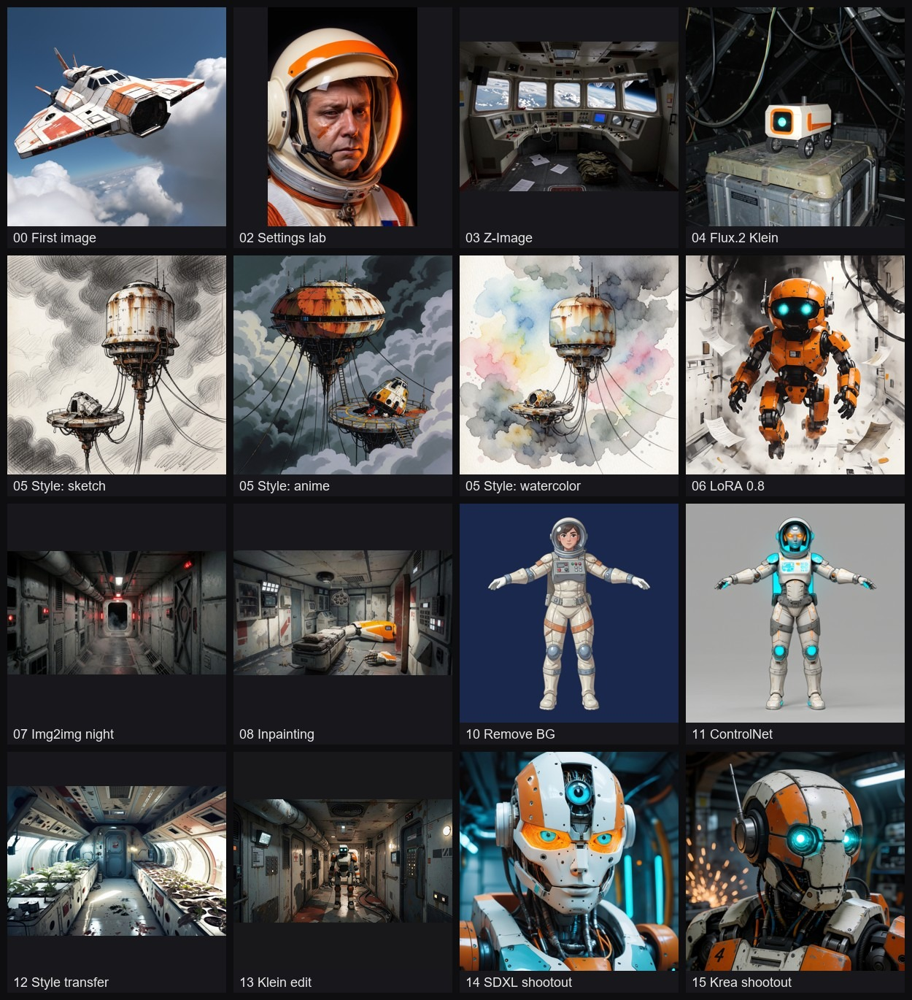
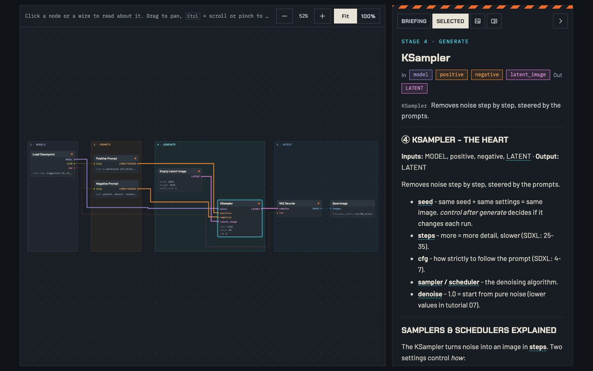

# ComfyUI tutorials (Meridian theme)

A graded series of ComfyUI tutorial workflows. Each one is a tested workflow with Markdown note boxes that explain every stage, saved into ComfyUI's Workflows → Tutorials folder. The prompts and input images come from the game [Meridian](https://meridian-gules-eta.vercel.app/): a worn off-white survey ship above the storm clouds of Veyra, off-white and orange robots with cyan eyes, slow-burn horror.



## Companion website

**https://aarsla.github.io/comfyui-tutorials/**

Keep it open next to ComfyUI while you work through the tutorials. For each one it has:

- the tutorial's graph, laid out by the same rules as in ComfyUI (stages left to right, no wire behind a node). Click a node or a wire to read what it does and why it connects there.
- the tutorial's notes in a side panel, with a glossary definition behind every underlined term.
- the result image and the workflow download. When you open the workflow, ComfyUI offers to download any model you are missing.
- tutorial 01 as a wiring exercise you can do in the browser, with optional hints.

It also has a setup guide, an index of every node the course uses and the full glossary.



## Tutorials

| # | Tutorial | Model |
|---|---|---|
| 00 | Start here, node basics | SDXL |
| 01 | Exercise, wire it yourself | SDXL |
| 02 | Settings lab: seed, steps, CFG | SDXL |
| 03 | Z-Image Turbo with separate loaders | Z-Image Turbo |
| 04 | Flux.2 Klein, the sampler taken apart | Flux.2 Klein 4B |
| 05 | Krea-2 style lab | Krea-2 Turbo |
| 06 | Krea-2 LoRAs, strength and stacking | Krea-2 Turbo |
| 07 | Image to image, denoise | Krea-2 Turbo |
| 08 | Inpainting with masks | SDXL |
| 09 | Upscaling | 4x-UltraSharp, RealESRGAN |
| 10 | Remove background | BiRefNet |
| 11 | ControlNet, copy a pose | SDXL + ControlNet Union |
| 12 | Style transfer from a reference image | SDXL + IP-Adapter |
| 13 | Image editing with Flux.2 Klein | Flux.2 Klein 4B |
| 14 | Sampler shootout, SDXL | SDXL |
| 15 | Sampler shootout, Krea-2 Turbo | Krea-2 Turbo |

`tutorials.py` has the exact graph and notes for each one.

## Files

```
tutorials.py              every tutorial as an API prompt plus its notes (the source of truth)
comfy.py                  run(prompt): queue an API prompt, wait, return output file paths
test_tutorials.py [NN..]  run all or selected tutorials through the API, write test_results.json
publish.py [NN..]         stage tutorials and layout scripts in ComfyUI userdata; --cleanup removes them,
                          --fetch copies the built workflows into workflows/Tutorials/
layout/build_layout.js    in-page builder: stage frames, column layout, wire routing, notes, checks
layout/build_exercise.js  in-page builder for exercise tutorials (no wires, hint boxes)
make_samples.py           generate sample input images with Z-Image
get_loras.py              download and sha256-check the Krea-2 style LoRAs
images/                   result gallery and sampler shootout sheets
workflows/Tutorials/      the built workflows, as saved in ComfyUI (served by the site)
models.json               model files with folder and download URL
site/                     the website (Astro)
```

## Working on the website

The site lives in `site/` (Astro) and deploys to GitHub Pages on every push to `main` that touches the site, `tutorials.py`, `models.json` or `workflows/Tutorials/` (`.github/workflows/deploy.yml`).

```
cd site
npm install
npm run dev      # http://localhost:4321/comfyui-tutorials/
npm run build    # static site in site/dist
npm run check    # every lesson graph: no wire behind a node
```

The build reads `tutorials.py` and `models.json` directly and serves the saved workflows from `workflows/Tutorials/`. After rebuilding the workflows in ComfyUI, run `python publish.py --fetch` so the site serves the new versions.

## Requirements

- ComfyUI running at `http://127.0.0.1:8188`
- The models listed in `CLAUDE.md` (SDXL Juggernaut XL v9, Z-Image Turbo, Krea-2 Turbo, Flux.2 Klein 4B, plus the upscalers, BiRefNet, ControlNet Union and IP-Adapter)
- The Meridian game art in ComfyUI's input folder
- Python with Pillow (the ComfyUI venv works)

## Adding or changing a tutorial

1. Add an entry to `T` in `tutorials.py`: `{"file": "NN - Title.json", "prompt": {...}, "notes": [...]}`.
2. Run `python test_tutorials.py NN` and look at the output images.
3. Run `python publish.py NN` to stage it.
4. In the ComfyUI page, run the staged `tmp_build.js` and `tmp_exercise.js`. Each line should report `overlaps=0 wire-through-node=0 prompt=identical`.
5. Run `python publish.py --cleanup`, then press Ctrl+R in Comfy Desktop.

`CLAUDE.md` has the full procedure, layout rules and known pitfalls.
